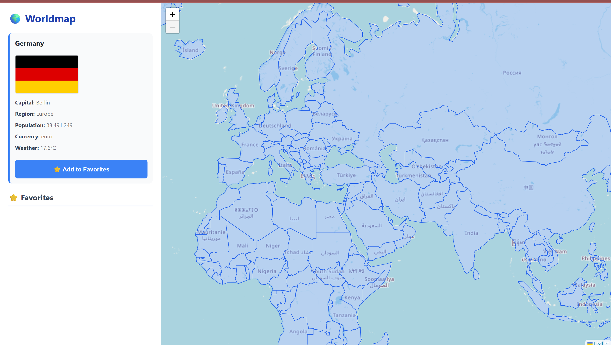
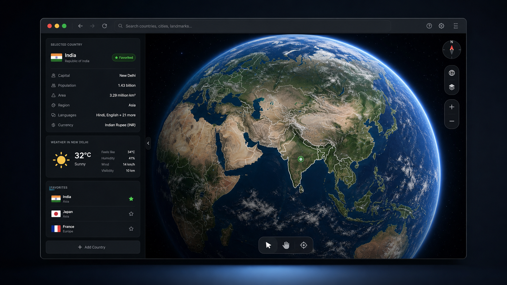

# Interactive World Map

<p align="center">
  
</p>

<p align="center">
  <strong>A modern browser-based world map for exploring countries, live weather data, and geographic information in 2D and 3D.</strong>
</p>

<p align="center">
  <a href="https://tribye.github.io/Interactive-Map/2D%20Version/index.html">
    
  </a>
  <a href="https://tribye.github.io/Interactive-Map/3D%20Version/index.html">
    
  </a>
  <a href="https://github.com/tribye/interactive-map">
    
  </a>
</p>

<p align="center">
  
  
  
  
  
</p>

## Overview

Interactive World Map is a lightweight web project that combines a clean map interface with live country data. Users can click a country, view its flag and key facts, check current weather for the capital city, and save favorite countries directly in the browser.

The project includes three versions:

- **2D Version**: a responsive Leaflet map focused on country selection and information.
- **2D/3D Version**: a hybrid map experience using Leaflet and Cesium for a globe-style exploration mode.
- **3D Version**: a globe only mode with country searchbar and flyin

## Preview

| 2D Map Experience | 3D Globe Experience |
| --- | --- |
|  |  |

## Features

- Interactive world map with country outlines
- Hover and click interactions for countries
- Country details from live REST Countries data
- Flag, capital, region, population, and currency display
- Current temperature for capital cities through Open-Meteo
- Favorite countries saved with `localStorage`
- 2D map implementation with Leaflet and OpenStreetMap tiles
- Optional 3D globe mode powered by Cesium
- Responsive layout for desktop and smaller screens

## Tech Stack

- **HTML5** for the app structure
- **CSS3** for responsive layouts and visual styling
- **JavaScript** for map logic, API requests, and state handling

## Data Sources and APIs

- **OpenStreetMap**: map tiles
- **Leaflet**: 2D map rendering
- **GeoJSON country borders**: country outlines
- **REST Countries API**: country information and flags
- **Open-Meteo Geocoding API**: capital city coordinates
- **Open-Meteo Forecast API**: current weather data
- **CesiumJS**: 3D globe rendering

## Project Structure

```text
Interactive-Map/
|-- 2D Version/
|   |-- index.html
|   |-- script.js
|   `-- style.css
|-- 2-3D Version/
|   |-- index.html
|   |-- script.js
|   `-- style.css
|-- docs/
|   `-- assets/
|       |-- interactive-map-2d-preview.png
|       `-- interactive-map-3d-preview.png
`-- README.md
```
